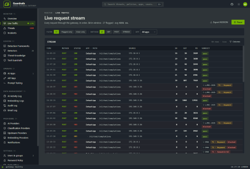

<p align="center">The open source AI firewall for LLM applications.</p>
<p align="center">
  <a href="https://c6web.com/guardrails/docs/"></a>
  <a href="https://discord.gg/xJdwYcVWqj"></a>
</p>

---

### What is C6 Guardrails?

**C6 Guardrails** is an open source AI firewall that sits between your LLM applications and upstream providers, inspecting every request and response against OWASP LLM Top 2025 threat policies. It works with any LLM — local or cloud — and can deploy and run in a 100% closed network environment. It features an 8-stage Rust-based pipeline, a real-time management console, and support for OpenAI, Anthropic, Gemini, Ollama, and OpenRouter.

<p align="center">
  <a href="https://c6web.com/guardrails/">
    <picture>
      
    </picture>
  </a>
</p>

### Problems We Solve

AI governance and compliance introduce cybersecurity requirements that every organization must address. Instead of each team building their own solution from scratch, **C6Web** and **Victor Tong** designed C6 Guardrails as an open source AI firewall platform to support these requirements out of the box.

### Quick Start

```bash
# All-in-one demo build — provisions PostgreSQL, runs migrations/seeds, starts all services
./start_aio_demo.sh
```

The gateway is at `http://localhost:8082`, the frontend at `http://localhost:3634`.

> [!TIP]
> Add `127.0.0.1 demo1.c6web.com` to `/etc/hosts` for HTTPS access at `https://demo1.c6web.com:3635`.

> [!WARNING]
> This is an all-in-one demo build intended for evaluation and development. For production deployments, review the [hardening and production setup guide](https://c6web.com/guardrails/docs/production-hardening).

### Architecture

```
AI Apps → GatewayEngine (Rust pipeline) → Upstream LLM API

Management Console → Backend (Express) → PostgreSQL (data + users + logs)
```

The gateway proxies AI application traffic, evaluates requests against OWASP LLM Top 2025 threat policies with an 8-stage pipeline (auth, rate limit, ACL, classification, enforcement, tool guardrails, response scanning, content quality), and provides a real-time management console with 47 pages.

### Services

| Service | Directory | Port |
|---|---|---|
| **GatewayEngine** | `gateway-engine/` | 8082 |
| **Backend** | `backend/` | 3635 |
| **Frontend** | `frontend/` | 3634 |

### Documentation

For more info on configuration, deployment, and usage, [**head over to our docs**](https://c6web.com/guardrails/docs/).

### Contributing

Edit files on the host (`backend/src/`, `frontend/src/`, `gateway-engine/src/`). Docker bind mounts sync changes live — no container restart needed. Run `./start_dev.sh` to rebuild after structural changes.

---

**Default admin login:** `admin` / `password` — you will be prompted to change the password on first login.

This software is owned by **[Victor Tong](https://www.linkedin.com/in/vsctong) and [C6Web](https://c6web.com)** and is licensed under [Apache 2.0](LICENSE), with an additional branding attribution requirement — see [NOTICE](NOTICE).

**Join our community** [Discord](https://discord.gg/xJdwYcVWqj)
